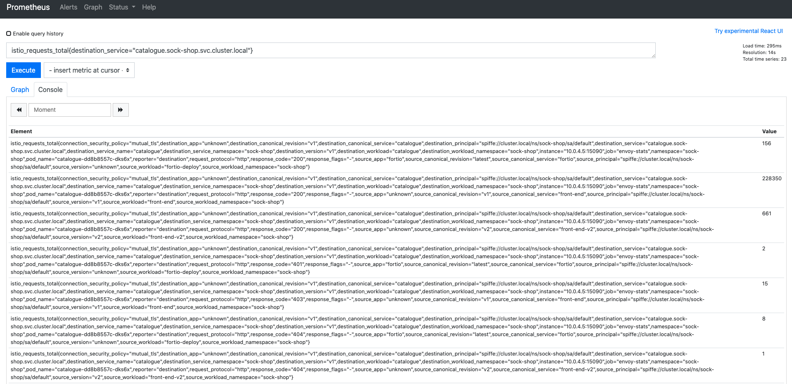
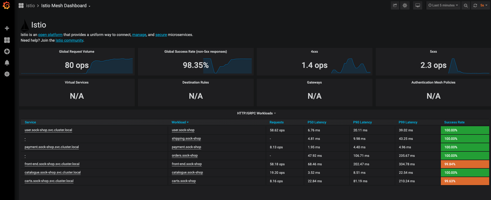
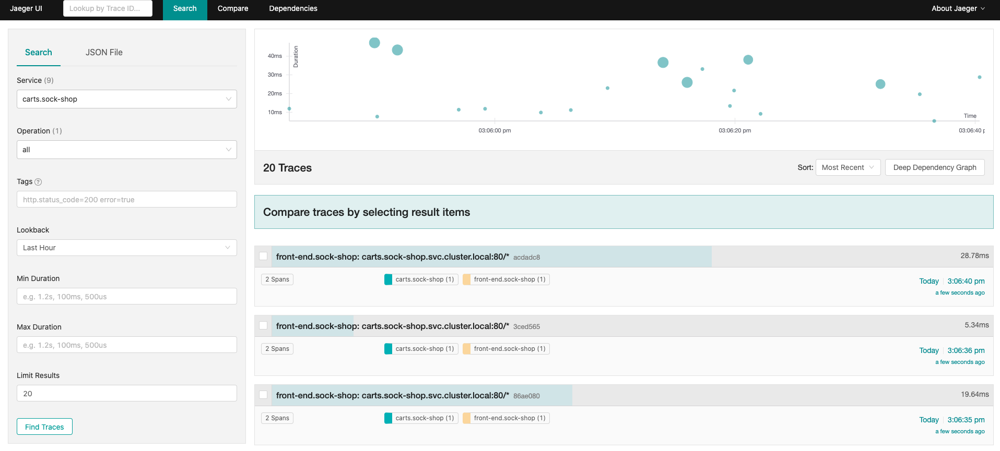
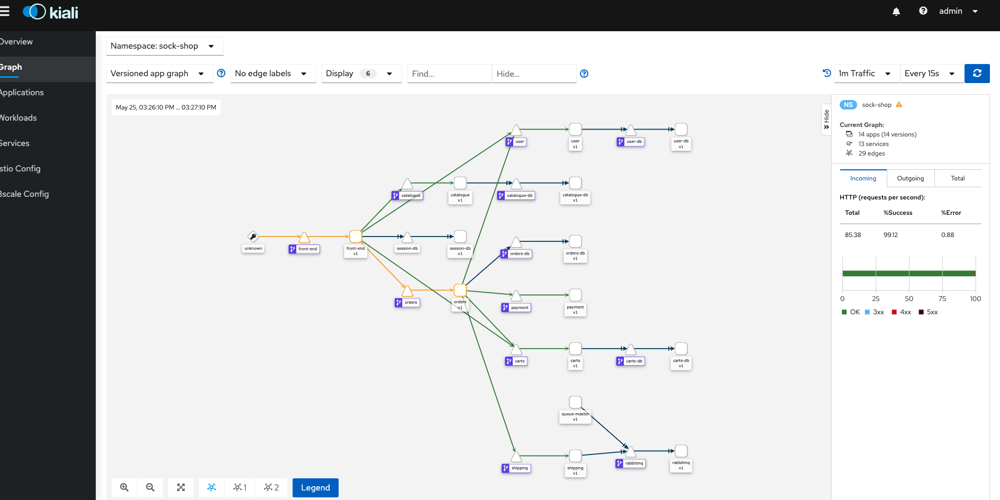

# Service Mesh Demo
This repo contains demo for my talk about service meshes. It is based on [microservices-demo application](https://github.com/microservices-demo/microservices-demo) with some minor changes to make it play nicely with istio. 

This demo is deployed and tested with `kubernetes 1.20` and `istio 1.11.3`


## Content
- [0. Install istio](#0-install-istio)
- [1. Deployment](#1-deploy-application)
    - [deploy application](#1-deploy-the-application)
    - [Configure Istio virtual services & Distination rules](#2-configure-istio-virtual-services--distination-rules)
    - [Configure Istio ingress gateway](#3-configure-istio-ingress-gateway)
    - [Verifying our config](#4-verifying-our-config)
    - [5. User accounts](#5-user-accounts)
- [2. Traffic Management](#2-traffic-management)
    - [1. Blue/Green Deployment](#1-bluegreen-deployment)
    - [2. Canary deployment](#2-canary-deployment)
    - [3. Route based on some criteria](#3-route-based-on-some-criteria)
    - [4. Mirroring](#4-mirroring)
- [3. Resiliency](#3-resiliency)
    - [1. Fault injection](#1-fault-injection)
    - [2. Load-Balancing Strategy](#2-load-balancing-strategy)
    - [3. Circuit Breaking](#3-circuit-breaking)
    - [4. Retries](#4-retries)
    - [5. Timeouts](#5-timeouts)
- [4. Policy](#4-policy)
    - [1. Rate limiting](#1-rate-limiting)
    - [2. CORS](#2-cors)
- [5. Security](#5-Security)
    - [1. mutual TLS authentication](#1-mutual-tls-authentication)
    - [2. Authorization for HTTP traffic](#2-authorization-for-http-traffic)
    - [3. JWT](#3-jwt)
- [6. Observability](#6-observability)
    - [1. Prometheus](#1-prometheus)
    - [2. Grafana](#-2-grafana)
    - [3. Tracing](#3-tracing)
    - [4. Kiali](#4-kiali)
## 0. Install istio
1. Refer to [istio docs](https://istio.io/docs/setup/install/) for different methods on how to install istio. Istio will be installed in a deferent namespace called `istio-system`
2. Create a namespace for our application and add a namespace label to instruct Istio to automatically inject Envoy sidecar proxies during deployment of sock-shop app. 
```bash
$ kubectl apply -f 1-deploy-app/manifests/sock-shop-ns.yaml 
```
You can find more about sidecar injection [here](https://istio.io/docs/setup/additional-setup/sidecar-injection/)
## 1. Deployment
No changes we're made to the original k8s manifests from [microservices-demo repo](https://github.com/microservices-demo/microservices-demo) except:

+ updating `Deployment` resources to use the sable api `apps/v1` required since [k8s 1.16](https://kubernetes.io/blog/2019/09/18/kubernetes-1-16-release-announcement/)
+ added `version: v1` label to all Kubernetes deployments. We need it for Istio `Destination Rules` to work properly

### 1. deploy app
```bash
$ kubectl apply -f 1-deploy-app/manifests
```

### 2. Configure Istio virtual services & Distination rules
```bash
$ kubectl apply -f 1-deploy-app/sockshop-virtual-services.yaml
```
Along with virtual services, destination rules are a key part of Istio’s traffic routing functionality. You can think of virtual services as how you route your traffic to a given destination, and then you use destination rules to configure what happens to traffic for that destination.

### 3. Configure Istio ingress gateway
```bash
$ kubectl apply -f 1-deploy-app/sockshop-gateway.yaml
```
An ingress Gateway describes a load balancer operating at the edge of the mesh that receives incoming HTTP/TCP connections. It configures exposed ports, protocols, etc. but, unlike Kubernetes Ingress Resources, It does not include any traffic routing configuration.

### 4. Verifying our config
```bash
$ istioctl proxy-status
```
Using the `istioctl proxy-status` command allows us to get an overview of our mesh. If you suspect one of your sidecars isn’t receiving configuration or is not synchronized, proxy-status will let you know. 

If everything is fine, run the below command to open sock-shop app in your browser
```bash
$ open "http://$(kubectl -n istio-system get service istio-ingressgateway -o jsonpath='{.status.loadBalancer.ingress[0].ip}'):$(kubectl -n istio-system get service istio-ingressgateway -o jsonpath='{.spec.ports[?(@.name=="http2")].port}')"
```

Note: If you are using `minikube`, remember to run 
```bash 
minikube tunnel
```
This will ensure you can open the url above in your browser.

If everything is fine you should see the app up and running along with some socks :) 
### 5. User accounts

|Username |	Password|
|---------|:--------|
|user	  | password|
|user1	  | password|

## 2. Traffic Management
Istio’s traffic routing rules let you easily control the flow of traffic and API calls between services. Istio simplifies configuration of service-level properties like circuit breakers, timeouts, and retries, and makes it easy to set up important tasks like A/B testing, canary rollouts, and staged rollouts with percentage-based traffic splits.

We start by rolling a new Deployment of `v2` version of the front-end service
```bash
$ kubectl apply -f 2-traffic-management/front-end-dep-v2.yaml
```
now we have 2 versions of the front-end app running side by side. However if you hit the browser you'll see only the `v1` (blue)

#### 1. Blue/Green Deployment
Blue-green deployment is a technique that reduces downtime and risk by running two identical production environments called Blue and Green.
Now let's switch to `v2` (red) as live environment serving all production traffic. 
```bash
$ kubectl apply -f 2-traffic-management/blue-green/frontv2-virtual-service.yaml
```
Now if you check the app, you'll see only the `v2` (red version) of our application. Same way, you can rollback at any moment to the old version
```bash
$ kubectl apply -f 2-traffic-management/blue-green/frontv1-virtual-service.yaml
```
#### 2. Canary deployment
Istio’s routing rules provides important advantages; you can easily control fine-grained traffic percentages (e.g., route 10% of traffic without requiring 100 pods) and you can control traffic using other criteria (e.g., route traffic for specific users to the canary version). To illustrate, let’s look at deploying the `front-end` service and see how simple to achieve canary deployment using istio.

For that, we need to set a routing rule to control the traffic distribution by sending 20% of the traffic to the canary (`v2`). execute the following command
```bash
$ kubectl apply -f 2-traffic-management/canary/canary-virtual-service.yaml 
```
and refresh the page a couple of times. The majority of pages return `v1` (blue), with some `v2` (red) from time to time.
#### 3. Route based on some criteria
With istio, we can easily route requests when they met some desired criteria. 
For now we have `v1` and `v2` deployed in our clusters, we can forward all forward all users using `Firefox` to `v2`, and serve `v1` to all other clients:
```bash
$ kubectl apply -f 2-traffic-management/route-headers/frontv2-virtual-service-firefox.yaml
```
#### 4. Mirroring
Traffic mirroring (also called shadowing), is a powerful concept that allows feature teams to bring changes to production with as little risk as possible. Mirroring sends a copy of live traffic to a mirrored service. You can then send the traffic to out-of-band of the critical request path for the primary service (Content inspection, Threat monitoring, Troubleshooting)

```bash
$ kubectl apply -f 2-traffic-management/mirorring/mirror-v2.yaml 
```
This new rule sends 100% of the traffic to `v1` while mirroring the same traffic to `v2`. you can check the logs of v1 and `v2` pods to verify that logs created in `v2` are the mirrored requests that are actually going to `v1`.
#### 5. Clean up
```bash
$ kubectl apply -f 2-traffic-management/cleanup-virtual-service.yaml
$ kubectl delete -f 2-traffic-management/front-end-dep-v2.yaml  
```

## 3. Resiliency
### 1. Fault injection
Fault injection is an incredibly powerful way to test and build reliable distributed applications.
Istio allows you to configure faults for HTTP traffic, injecting arbitrary delays or returning specific response codes (e.g., 500) for some percentage of traffic.
#### Delay fault
In this example. we gonna inject five seconds delay for all traffic calling the `catalogue` service. This is a great way to reliably test how our app behaves on a bad network.
```bash
$ kubectl apply -f 3-resiliency/fault-injection/delay-fault-injection-virtual-service.yaml
```
Open the application and you can see that it takes now longer to render catalogs
#### Abort fault
Replying to clients with specific response codes, like a 429 or a 500, is also great for testing. For example, it can be challenging to programmatically test how your application behaves when a third-party service that it depends on begins to fail. Using Istio, you can write a set of reliable end-to-end tests of your application’s behavior in the presence of failures of its dependencies.

For example, we can simulate 10% of requests to `catalogue` service is failing at runtime with a 500 response code.
```bash
$ kubectl apply -f 3-resiliency/fault-injection/abort-fault-injection-virtual-service.yaml 
$ open "http://$(kubectl -n istio-system get service istio-ingressgateway -o jsonpath='{.status.loadBalancer.ingress[0].ip}'):$(kubectl -n istio-system get service istio-ingressgateway -o jsonpath='{.spec.ports[?(@.name=="http2")].port}')/catalogue"
```
Refresh the page a couple of times. You'll notice that sometimes it doesn't return the json list of catalogs

### 2. Load-Balancing Strategy
Client-side load balancing is an incredibly valuable tool for building resilient systems. By allowing clients to communicate directly with servers without going through reverse proxies, we remove points of failure while still keeping a well-behaved system.
By default, Istio uses a round-robin load balancing policy, where each service instance in the instance pool gets a request in turn. Istio supports other options that you can check [here](https://istio.io/docs/concepts/traffic-management/#load-balancing-options)

More complex load-balancing strategies such as consistent hash-based load balancing are also supported. In this example we set up sticky sessions for `catalogue` based on source IP address as the hash key.
```bash
$ kubectl apply -f 3-resiliency/load-balancing/load-balancing-consistent-hash.yaml
```
### 3. Circuit Breaking
Circuit breaking is a pattern of protecting calls (e.g., network calls to a remote service) behind a `circuit breaker`. If the protected call returns too many errors, we `trip` the circuit breaker and return errors to the caller without executing the protected call. 

For example, we can configure circuit breaking rules for `catalogue` service and test the configuration by intentionally `tripping` the circuit breaker. To achieve this, we gonna use a simple load-testing client called [fortio](https://github.com/fortio/fortio). Fortio lets us control the number of connections, concurrency, and delays for outgoing HTTP calls. 
```bash
$ kubectl apply -f 3-resiliency/circuit-breaking/circuit-breaking.yaml 
$ kubectl apply -f 3-resiliency/circuit-breaking/fortio.yaml 
$ FORTIO_POD=$(kubectl get pod -n sock-shop| grep fortio | awk '{ print $1 }')  
$ kubectl -n sock-shop exec -it $FORTIO_POD  -c fortio /usr/bin/fortio -- load -c 4 -qps 0 -n 40 -loglevel Warning http://catalogue/tags
```
In the `DestinationRule` settings, we specified `maxConnections: 1` and `http1MaxPendingRequests: 1`. They indicate that if we exceed more than one connection and request concurrently, you should see some failures when the istio-proxy opens the circuit for further requests and connections. 
While testing, should expect something similar to this output:
```
Sockets used: 28 (for perfect keepalive, would be 4)
Code 200 : 14 (35.0 %)
Code 503 : 26 (65.0 %)
```
### 4. Retries
Every system has transient failures: network buffers overflow, a server shutting down drops a request, a downstream system fails, and so on.

Istio gives you the ability to configure retries globally for all services in your mesh. More significant, it allows you to control those retry strategies at runtime via configuration, so you can change client behavior on the fly.

The following example configures a maximum of 3 retries to connect to `catalogue` service subset after an initial call failure, each with a 1s timeout.
```bash
$ kubectl apply -f 3-resiliency/retry/retry-virtual-service.yaml
```
Worth noting that retry policy defined in a `VirtualService` works in concert with the connection pool settings defined in the destination’s `DestinationRule` to control the total number of concurrent outstanding retries to the destination.
### 5. Timeouts
Timeouts are important for building systems with consistent behavior. By attaching deadlines to requests, we’re able to abandon requests taking too long and free server resources.

Here we configure a virtual service that specifies a 5 second timeout for calls to the `v1` subset of the `catalogue` service:
```bash
$ kubectl apply -f 3-resiliency/timeout/timeout-virtual-service.yaml
```

We combined in the example the use of retry and timeout. The timeout represents then the total time that the client will spend waiting for a server to return a result.
### 5. Clean up
```bash
$ kubectl apply -f 3-resiliency/cleanup-virtual-service.yaml
$ kubectl delete -f 3-resiliency/circuit-breaking/fortio.yaml 
```

## 4. Policy
### 1. Rate limiting
Rate limiting is generally put in place as a defensive measure for services. Shared services need to protect themselves from excessive use (whether intended or unintended) to maintain service availability.
#### Global rate limiting
Before istio 1.5, the recommended way to set up rate limiting in Istio was to use [mixer policy](https://istio.io/docs/tasks/policy-enforcement/rate-limiting/). In `version 1.5` the mixer policy is deprecated and not recommended for production, and the  preferred way is using [Envoy native rate limiting](https://www.envoyproxy.io/docs/envoy/v1.13.0/intro/arch_overview/other_features/global_rate_limiting) instead of mixer rate limiting. 
There is no native support yet for rate limiting API with Istio. Thus, we'll be using the [Envoy rate limit service](https://github.com/envoyproxy/ratelimit), which is is a Go/gRPC service designed to enable generic rate limit scenarios from different types of applications.
To mimic a real world example, we suppose that we have 2 plans: 
+ Basic: 5 requests pe minute
+ Plus: 20 requests per minute

We configure Envoy rate limiting actions to look for `x-plan` and `x-account` in request headers. We also configure the descriptor match any request with the account and plan keys, such that (`'account', '<unique value>')`, `('plan', 'BASIC | PLUS')`. The `account` key doesn't specify any value, it uses each unique value passed into the rate limiting service to match. The `plan` descriptor key has two values specified and depending on which one matches (BASIC or PLUS) determines the rate limit, either 5 request per minute for `BASIC` or 20 requests per minute for `PLUS`.
```
$ kubectl apply -f 4-policy/rate-limiting/global/rate-limit-service.yaml
$ kubectl apply -f 4-policy/rate-limiting/global/rate-limit-envoy-filter.yaml 
``` 
Testing the above scenarios prove that the rate limiting is working
```bash
#### DEPLOY FORTIO
$ kubectl apply -f 4-policy/fortio.yaml 
$ export INGRESS_IP=$(kubectl -n istio-system get service istio-ingressgateway -o jsonpath='{.status.loadBalancer.ingress[0].ip}')
$ FORTIO_POD=$(kubectl get pod -n sock-shop| grep fortio | awk '{ print $1 }')  
####  BASIC PLAN
$ kubectl -n sock-shop exec -it $FORTIO_POD  -c fortio /usr/bin/fortio -- load -c 1 -qps 0 -n 2 -loglevel Warning -H "x-plan: BASIC" -H "x-account: user" $INGRESS_IP/catalogue
...
Sockets used: 5 (for perfect keepalive, would be 1)
Code 200 : 1 (50.0 %)
Code 429 : 1 (50.0 %)
### PLUS PLAN
$ kubectl -n sock-shop exec -it $FORTIO_POD  -c fortio /usr/bin/fortio -- load -c 1 -qps 0 -n 4 -loglevel Warning -H "x-plan: PLUS" -H "x-account: user2" $INGRESS_IP/catalogue
...
Sockets used: 5 (for perfect keepalive, would be 1)
Code 200 : 2 (50.0 %)
Code 429 : 2 (50.0 %)
```

Or you can use curl from your terminal:

```bash
curl --request GET "http://${INGRESS_IP}/catalogue" -I --header 'x-plan: BASIC' --header 'x-account: user'

curl --request GET "http://${INGRESS_IP}/catalogue" -I --header 'x-plan: PLUS' --header 'x-account: user'
```

You can check in redis how keys are stored:

```bash
export REDIS_POD=$(kubectl get pod -n rate-limit | grep redis | awk '{ print $1 }')

k -n rate-limit exec -it $REDIS_POD -c redis /bin/sh

redis-cli

keys *

```
#### Local rate limiting
Envoy supports local rate limiting of L4 connections and HTTP requests. This allows  to apply rate limits at the instance level, in the proxy itself, without calling any other service.
In this example, we are going to enable local rate limiting for any traffic through the `catalogues` service. The local rate limit filter’s token bucket is configured to allow 10 requests/min. The filter is also configured to add an x-local-rate-limit response header to requests that are blocked.
```
$ kubectl apply -f 4-policy/rate-limiting/local/rate-limit-envoy-filter.yaml 
```
Testing the above scenarios prove that local rate limiting is working
```
$ kubectl -n sock-shop exec -it $FORTIO_POD  -c fortio /usr/bin/fortio -- load -c 4 -qps 0 -n 20 -loglevel Warning http://catalogue/tags
```
you shouls ge the below results
```
Code 200 : 10 (50.0 %)
Code 429 : 10 (50.0 %)
```
### 2. CORS
Cross-Origin Resource Sharing (CORS) is a method of enforcing client-side access controls on resources by specifying external domains that are able to access certain or all routes of your domain. Browsers use the presence of HTTP headers to determine if a response from a different origin is allowed.

For example, the following rule restricts cross origin requests to those originating from `aboullaite.me` domain using HTTP POST/GET, and sets the `Access-Control-Allow-Credentials` header to false. In addition, it only exposes `X-Foo-bar` header and sets an expiry period of 1 day.

```bash 
$ kubectl apply -f 4-policy/cors/cors-virtual-service.yaml  
```
Checking now CORS options to confirm that the config effectively took place
```bash
curl -I -X OPTIONS -H 'access-control-request-method: PUT' -H 'origin: http://aboullaite.me' http://$INGRESS_IP/catalogue
#### should return output below
HTTP/1.1 200 OK
access-control-allow-origin: http://aboullaite.me
access-control-allow-methods: POST,GET
access-control-allow-headers: X-Foo-Bar
access-control-max-age: 86400
date: Sat, 23 May 2020 15:40:05 GMT
server: istio-envoy
content-length: 0
```
### 3. Clean up
```bash
$ kubectl apply -f 4-policy/cleanup-virtual-service.yaml
$ kubectl delete -f 4-policy/fortio.yaml 
$ kubectl delete -f 4-policy/rate-limiting/global/rate-limit-service.yaml
$ kubectl delete -f 4-policy/rate-limiting/global/rate-limit-envoy-filter.yaml 
$ kubectl delete -f 4-policy/rate-limiting/local/rate-limit-envoy-filter.yaml 
```

## 5. Security
### 1. mutual TLS authentication
With all of the identity certificates (SVIDs) distributed to workloads across the system, how do we actually use them to verify the identity of the servers with which we’re communicating and perform authentication and authorization? This is where mTLS comes into play.
mTLS (mutual TLS) is TLS in which both parties, client and server, present certificates to each other. This allows the client to verify the identity of the server, like normal TLS, but it also allows the server to verify the identity of the client attempting to establish the connection. 
In this example, we will migrate the existing Istio services traffic from plaintext to mutual TLS without breaking live traffic.

Istio 1.5 brings the concept of PeerAuthentication, which is a CRD that allows us to enable and configure mTLS at both the cluster level and namespace level. First we start by enabling mTLS:
```bash
$ kubectl apply -f 5-security/mtls/peer-auth-mtls.yaml
$ kubectl apply -f 5-security/mtls/destination-rule-tls.yml  
```

To confirm that plain-text requests fail as TLS is required to talk to any service in the mesh, we redeploy `fortlio` by disabling sidecare injection this time. and run some requests
```bash
$ kubectl apply -f 5-security/fortio.yaml
$ FORTIO_POD=$(kubectl get pod -n sock-shop| grep fortio | awk '{ print $1 }')  
$ kubectl -n sock-shop exec -it $FORTIO_POD  -c fortio /usr/bin/fortio -- load -curl -k http://catalogue/tags  
```
You should notice that fortio fails to make calls to `catalogue` service, and we get a `Connection reset by peer` which is what we expected.
Now how do we get a successful connection? In order to have applications communicate over mutual TLS, they need to be on-boarded onto the mesh. Or we can disable mTLS for `catalogue` service
```bash
$ kubectl apply -f 5-security/mtls/disable-mtls-catalogue.yaml
$ kubectl -n sock-shop exec -it $FORTIO_POD  -c fortio /usr/bin/fortio -- load -curl -k http://catalogue/tags  
```
You can see that the request was successful! But if you go to our app, you should notice that no catalogues are returned, we should re-enable mtls again in order to work:
```bash
$ kubectl apply -f 5-security/mtls/peer-auth-mtls.yaml
$ kubectl apply -f 5-security/mtls/destination-rule-tls.yml  
```
### 2. Authorization for HTTP traffic
Istio’s authorization features provide mesh-, namespace-, and workload-wide access control for your workloads in the mesh. 
We'll start by creating a deny-all policy for the `/catalogue` path in the front-end service
```bash
$ kubectl apply -f 5-security/http-auth/deny-policy.yaml   
```
Point your browser at the app (`http://$$INGRESS_IP/catalogue`). You should see "RBAC: access denied". The error shows that the configured deny-all policy is working as intended.
Let's fix this:
```bash
$ kubectl apply -f 5-security/http-auth/allow-policy.yaml   
```
Here we allow only `GET`  http method. If you try to call the link using a `POST` method for example, you should see "RBAC: access denied".
### 3. JWT
Another great feature of Istio authorization policy ia ability to enforce access based on a JSON Web Token (JWT). An Istio authorization policy supports both string typed and list-of-string typed JWT claims.
Let's start by creating a `RequestAuthentication` policy for the `front-end` workload in the `sock-shop` namespace. This policy for front-end workload accepts a JWT issued by `testing@secure.istio.io`. We'll create also a `AuthorizationPolicy` policy that requires all requests to the `front-end` workload to have a valid JWT with requestPrincipal set to `testing@secure.istio.io/testing@secure.istio.io`.
```bash
$ kubectl apply -f 5-security/jwt/jwt-request-auth.yaml  
```
Verify that a request with an invalid JWT is denied:
```bash
kubectl -n sock-shop exec -it $FORTIO_POD  -c fortio /usr/bin/fortio -- load -curl -H "Authorization: Bearer invalidToken" http://catalogue/tags
```
Verify that a request with a valid JWT is allowed:
```bash
$ TOKEN=$(curl https://raw.githubusercontent.com/aboullaite/service-mesh/master/5-security/jwt/data.jwt -s)
$ kubectl -n sock-shop exec -it $FORTIO_POD  -c fortio /usr/bin/fortio -- load -curl -H "Authorization: Bearer $TOKEN" http://catalogue/tags
```
PS: If you get `connection reset by peer` error, that because of mtls. check (mtls)[(#1-mutual-tls-authentication)] section for details on how to disable mtls for the catalogue service and enable it back after the testing.
### 4. Clean up
```bash
$ kubectl delete -f 5-security/jwt/jwt-request-auth.yaml
$ kubectl apply -f 5-security/http-auth/allow-all.yaml
$ kubectl delete -f 5-security/jwt/jwt-request-auth.yaml 
$ kubectl apply -f 5-security/fortio.yaml
## Making sure that mtls is configured for all services
$ kubectl apply -f 5-security/mtls/peer-auth-mtls.yaml
$ kubectl apply -f 5-security/mtls/destination-rule-tls.yml 
```

## 6. Observability
Insight is the number one reason why people deploy a service mesh. Not only do service meshes provide a level of immediate insight, but they also do so uniformly and ubiquitously. You might be accustomed to having individual monitoring solutions for distributed tracing, logging, security, access control, metering, and so on. Service meshes centralize and assist in consolidating these separate panes of glass by generating metrics, logs, and traces of requests transiting the mesh. 

To generate some load for our application, we deploy a small load testing app that packages a test script for [Locust](https://locust.io/) and simulates user traffic to Sock Shop:
```bash
$ kubectl apply -f 6-observability/loadtest-dep.yaml
```
### 1. Prometheus
First, let's verify that the [prometheus](https://prometheus.io/) service is running in the cluster:
```bash
$ kubectl -n istio-system get svc prometheus
```
You should see that its up and available on port 9090. Let's check it out by configuring port-forwarding:
```bash
$ kubectl -n istio-system port-forward $(kubectl -n istio-system get pod -l app=prometheus -o jsonpath='{.items[0].metadata.name}') 9090:9090 &
```
Next, open `localhost:9090` on your browser and let's query for total requests to catalogue service. In the `Expression` input box at the top of the web page, enter the text: `istio_requests_total{destination_service="catalogue.sock-shop.svc.cluster.local"}`. Then, click the Execute button. 



You can exit port-forwarding mode using `ctrl + c`
### 2. Grafana
[Grafana](https://grafana.com/) is mainly used to visualize the prometheus data. Similarly we verify that the service is running and use port-forwarding to visualize Grafana dashboard:
```bash
$ kubectl -n istio-system get svc grafana
$ kubectl -n istio-system port-forward $(kubectl -n istio-system get pod -l app=grafana -o jsonpath='{.items[0].metadata.name}') 3000:3000 &
```
Then open `localhost:3000`, click on `Istio Mesh Dashboard`. This gives the global view of the Mesh along with services and workloads in the mesh. You can get more details about services and workloads by navigating to their specific dashboards.



From the Grafana dashboard’s left hand corner navigation menu, you can navigate to Istio Service Dashboard and select any service. It gives details about metrics for the service and then client workloads (workloads that are calling this service) and service workloads (workloads that are providing this service) for that service.


### 3. Tracing
Tracing allows you to granularly track request segments (spans) as the request is processed across various services. It’s difficult to introduce later, as (among other reasons) third-party libraries used by the application also need to be instrumented.

Istio-enabled applications can be configured to collect trace spans using, for instance, the popular [Jaeger](https://www.jaegertracing.io/) distributed tracing system. Distributed tracing lets you see the flow of requests a user makes through your system, and Istio's model allows this regardless of what language/framework/platform you use to build your application.

Again, we configure port-forwarding using:
```bash
$ kubectl port-forward -n istio-system $(kubectl get pod -n istio-system -l app=jaeger -o jsonpath='{.items[0].metadata.name}') 16686:16686 &
```
From the left-hand pane of the dashboard, select any service from the Service drop-down list and click Find Traces:



Click on any trace to see details. The trace is comprised of a set of spans, where each span corresponds to a  service, invoked during the execution of a request


### 4. Kiali
First step, is to verify Kiali is running and port-forward to access kiali:
```bash
$ kubectl -n istio-system get svc kiali
$ kubectl -n istio-system port-forward $(kubectl -n istio-system get pod -l app=kiali -o jsonpath='{.items[0].metadata.name}') 20001:20001
```
Open kiali dashboard an login using `admin` as the username and password. you should the Overview page immediately after you log in. To view a namespace graph, click on the `sock-shop` graph icon in the Sock-Shop namespace card.



As you can see, the graph that Kiali generated is an excellent way to get a general idea of how a given microservices application is working behind the scenes, which services talk to which, stream flow...
To examine the details about the Istio configuration, click on the Applications, Workloads, and Services menu icons on the left menu bar. The following screenshot shows the Sock-shop applications information:


--- 
Ressources:
+ [Istio documentation](https://istio.io/docs/t)
+ [Microservices demo](https://microservices-demo.github.io/)
+ [istio up and running](https://www.oreilly.com/library/view/istio-up-and/9781492043775/)
